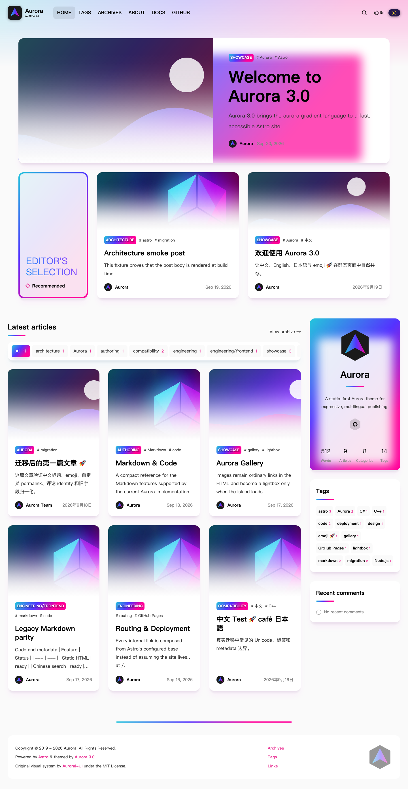
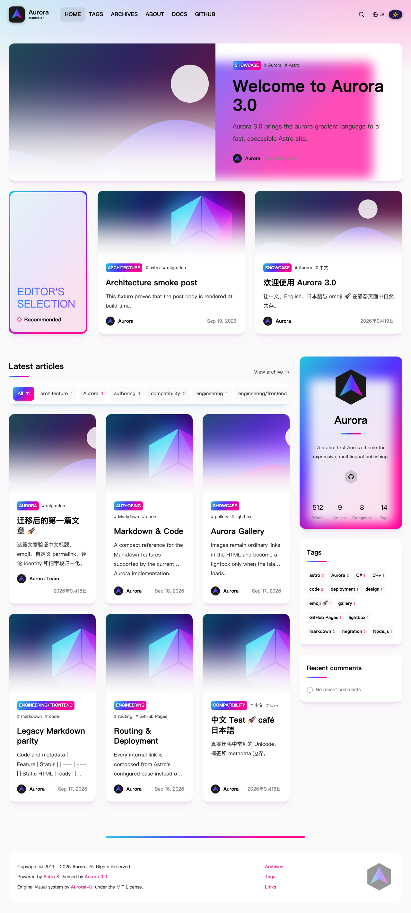
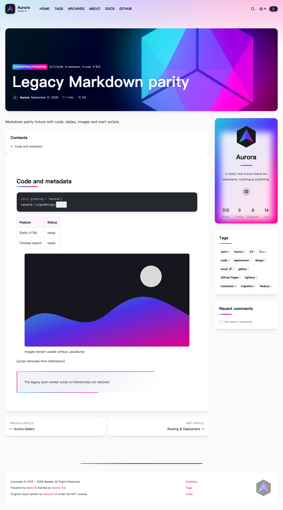
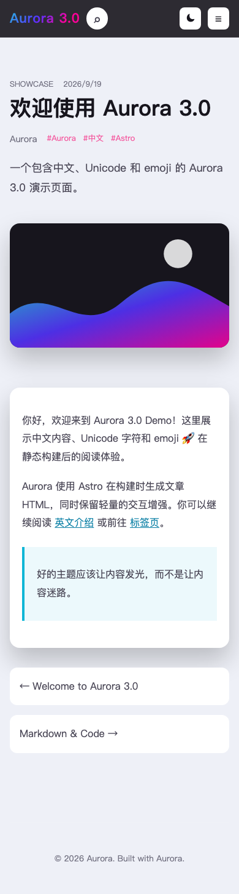

<div align="center">
  <a href="https://yanpuzhen.github.io/astro-theme-aurora/" target="_blank" rel="noopener noreferrer">
    
  </a>
  <br/>
  <h1>🏳️‍🌈 <b>Aurora 3.0</b> 🏳️‍🌈</h1>
  <strong>Futuristic auroral theme powered by Astro</strong>
</div>

<br/>

<p align="center">
  <a href="https://github.com/yanpuzhen/astro-theme-aurora"></a>
  <a href="https://github.com/yanpuzhen/astro-theme-aurora/network/members"></a>
  <a href="https://github.com/yanpuzhen/astro-theme-aurora/issues"></a>
  <a href="https://github.com/yanpuzhen/astro-theme-aurora/releases"></a>
  <a href="https://github.com/yanpuzhen/astro-theme-aurora/commits/main"></a>
  <a href="https://github.com/yanpuzhen/astro-theme-aurora/blob/main/LICENSE"></a>
  <a href="https://github.com/yanpuzhen/astro-theme-aurora/actions/workflows/rc.yml"></a>
</p>

<div align="center">

**[Preview](https://yanpuzhen.github.io/astro-theme-aurora/demo/)** |
**[Change Log](./CHANGELOG.md)** |
**[Document](https://yanpuzhen.github.io/astro-theme-aurora/)**

**[预览](https://yanpuzhen.github.io/astro-theme-aurora/demo/)** |
**[更新日志](./CHANGELOG.md)** |
**[使用文档](https://yanpuzhen.github.io/astro-theme-aurora/cn/)**

</div>

Aurora 3.0 is a static-first Astro theme for expressive publishing. It keeps Aurora's gradient-led visual identity while moving content, routing, metadata, and search into a build-time pipeline. Vue is used only for focused interactions.

> The Pages URLs become authoritative after the `dev → main` pull request is reviewed, merged, and the Pages workflow completes successfully.









## 🏳️‍🌈 What's in Aurora?

Aurora 3.0 is the Astro implementation of Aurora. The original Aurora project was created by TriDiamond / Benny Guo; this repository is the current 3.0 implementation.

### ⭐️ Features

- Static Astro rendering - _Posts and pages are emitted as HTML at build time._
- Content Collections - _Typed frontmatter normalization accepts the audited Aurora 2.x shapes._
- Pagefind search - _Build-time local search supports the generated English and Chinese pages._
- Bilingual content - _Static labels and content can use English or `zh-CN`._
- Responsive design - _Home, articles, taxonomies, archives, search, and mobile navigation adapt to small screens._
- Light and dark appearance - _Theme choice persists locally and does not gate content readability._
- Tags, categories, and archives - _Static taxonomy pages and pagination are generated from public posts._
- RSS, sitemap, robots, SEO, and JSON-LD - _Generated from the validated site configuration and deployment base._
- Optional comments - _giscus, Waline, and Twikoo first-class integrations, Valine legacy runtime, and deterministic Demo recent-comment fixtures._
- Build-time Markdown math - _GFM is provided by `remark-gfm`; inline/display equations are rendered by KaTeX._
- Lightbox, code copy, Dia, and mobile menu - _Interactive islands enhance ordinary static HTML._
- Custom permalinks and legacy identity - _The route manifest preserves explicit paths, UID inputs, and compatibility aliases._
- Nested-base deployment - _Documentation and Demo share one GitHub Pages artifact below separate base paths._

### 🎨 Theme

- Aurora gradients with light and dark colour systems.
- Magazine-style card grids for featured and latest posts.
- Timeline-style archive groups.
- Readable static HTML when JavaScript is disabled.

### 🛠 Configuration

Edit the root `_config.yml` for routine theme settings. Aurora parses and validates it at build time; invalid YAML, unknown canonical keys, and invalid values fail with a useful field path. Precedence is **environment overrides > `_config.yml` > Aurora defaults**.

```sh
# Install, configure, and run locally
pnpm install --frozen-lockfile
${EDITOR:-vi} _config.yml
pnpm dev

# Deployment-only origin/base overrides (optional when configured in YAML)
ASTRO_SITE=https://yanpuzhen.github.io \
ASTRO_BASE=/astro-theme-aurora/ \
pnpm build
```

Never put private credentials in `_config.yml` or `PUBLIC_*` variables; static build values are visible to site visitors. Gitalk runtime is removed; use giscus for GitHub Discussions after following the migration guide. See the [Getting Started guide](https://yanpuzhen.github.io/astro-theme-aurora/guide/getting-started), [configuration reference](https://yanpuzhen.github.io/astro-theme-aurora/configs/general), [Aurora 2 migration guide](https://yanpuzhen.github.io/astro-theme-aurora/upgrade/from-aurora-2), and [Internationalization guide](https://yanpuzhen.github.io/astro-theme-aurora/guide/internationalization).

Create posts in `src/content/posts/` and pages in `src/content/pages/`. The Demo publishes English and Chinese RSS at `/astro-theme-aurora/demo/rss.xml` and `/astro-theme-aurora/demo/cn/rss.xml`; its sitemap and robots file are also under the `/demo/` base.

### 🚫 Current architecture boundaries

Aurora 3.0 does not run the old Vue SPA, Vue Router, runtime article JSON API, or Hexo plugin runtime. Markdown scripts are inert/removed by default. The Demo's profile, recent comments, links, counters, and started date are clearly isolated deterministic fixtures; ordinary builds show only configured real values.

## 🍼 Feedback

- Please search the [existing issues](https://github.com/yanpuzhen/astro-theme-aurora/issues) before opening a new one.
- Report Aurora 3.0 bugs through a [new issue](https://github.com/yanpuzhen/astro-theme-aurora/issues/new).
- Repository discussions may be used if enabled by GitHub; they are not assumed to be available in this release.

## 💬 Join the Community

The original Aurora community links belong to the upstream project and are not presented as official support channels for this repository. For current Aurora 3.0 support, use the repository's [Issues](https://github.com/yanpuzhen/astro-theme-aurora/issues) and [Discussions](https://github.com/yanpuzhen/astro-theme-aurora/discussions) when enabled.

## Development

```sh
pnpm install --frozen-lockfile
pnpm dev
pnpm docs:dev
```

Before a pull request, run the source build and combined Pages checks:

```sh
pnpm test
pnpm check
pnpm build
pnpm docs:build
pnpm demo:build
pnpm pages:build
pnpm test:pages
pnpm run test:browser
pnpm run test:browser:pages
```

Development is integrated on `dev`; `main` is the release-ready branch. The production Pages workflow deploys only from `main`.

## Credits / Upstream

Aurora 3.0 preserves attribution to the original [Aurora project](https://github.com/auroral-ui/hexo-theme-aurora) and its [original documentation](https://github.com/auroral-ui/hexo-theme-aurora-docs). Their MIT license notices remain relevant to reused upstream material. This repository's current code is released under the license in [LICENSE](./LICENSE).
